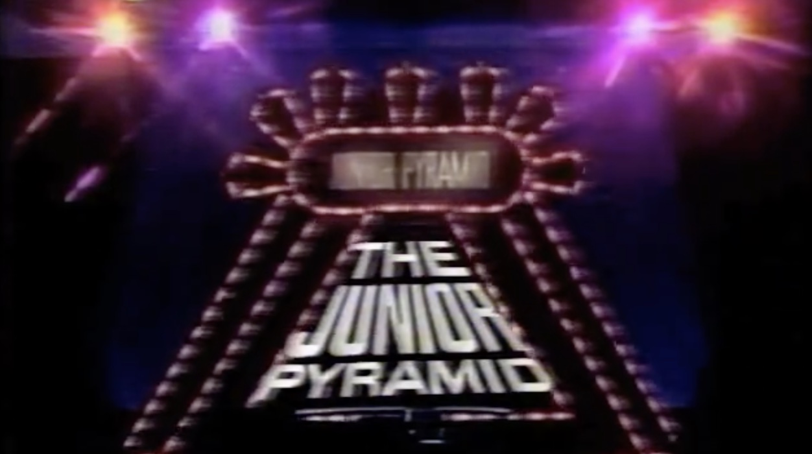
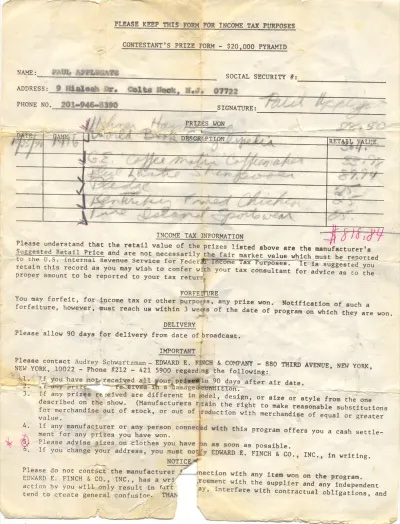
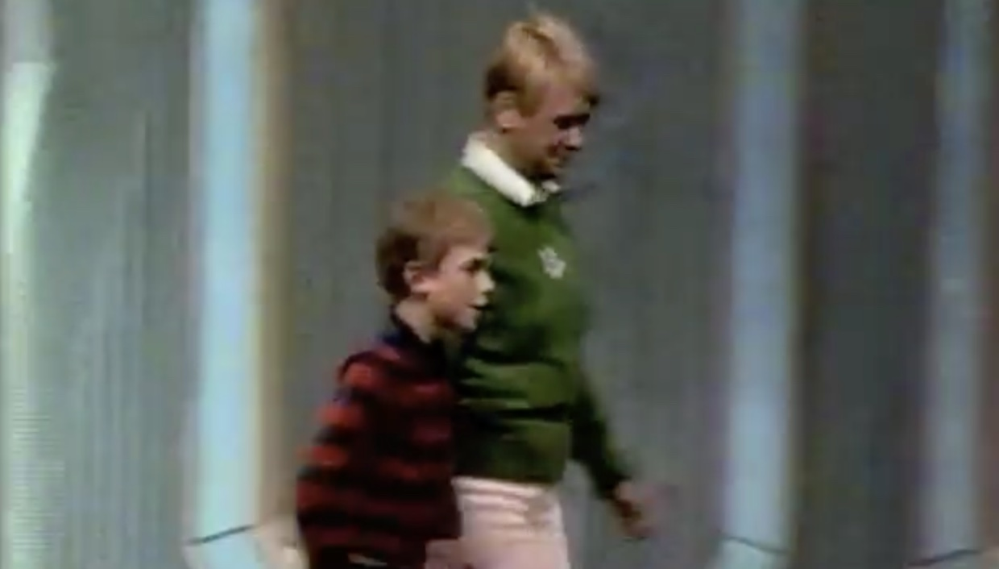

Here is some trivia about me. When I was 10 we lived in New Jersey. My mother was in the process of becoming a contestant on the $20,000 Pyramid.She was taken aside and asked if she wanted to appear on the $20,000 Junior Pyramid.
		 From October 1 to November 9, 1979, the series briefly became Junior Partner Pyramid, which scrapped the usual celebrity-contestant pairings in favor of children playing the game with a parent or other adult relative.[^1]

If you're curious what TV was like in 1979 then be all means watch the [episode](https://vimeo.com/26595314) the password is pa$$word.
Oh and I lost the game.

		 [^1] https://en.wikipedia.org/wiki/Pyramid_(game_show)